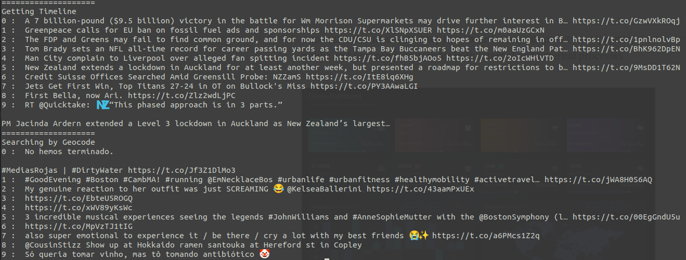
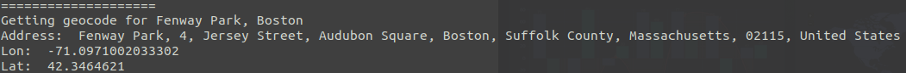
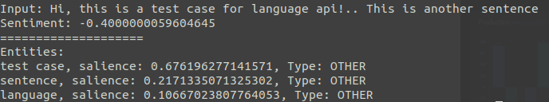
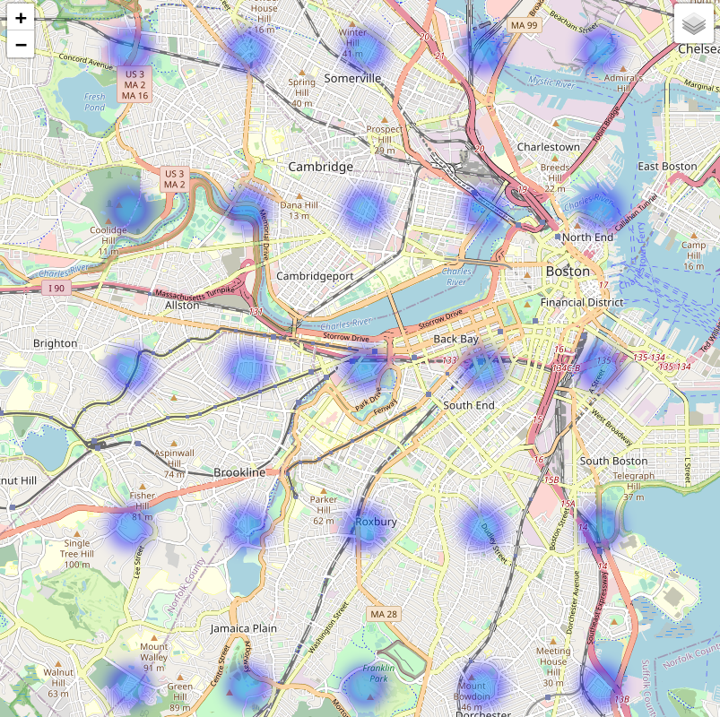

# Tweet Event Map

The goal of this project is to create a easy and intuitive tool of letting people know what is going on in their city based on tweets. 

## Requirements
    - python >= 3.6
    - tweepy >= v4.0.0
    - geopy >= 2.2.0
    - google-cloud-language >= 2.2.2

## Modules

### twitter_api

Retreiving tweets in given area specified using latitude and longitude.

### geocoder_api

Retreiving latitude and longitude and address of a given location.

### language_api

Performing NLP tasks such as sentiment analysis and entity extraction.

## Heatmap

Generating an interactive heatmap that shows the sentiment of different locations in the region. Below is an example of sentiments form a list of locations sampled uniformly in the Boston area.

