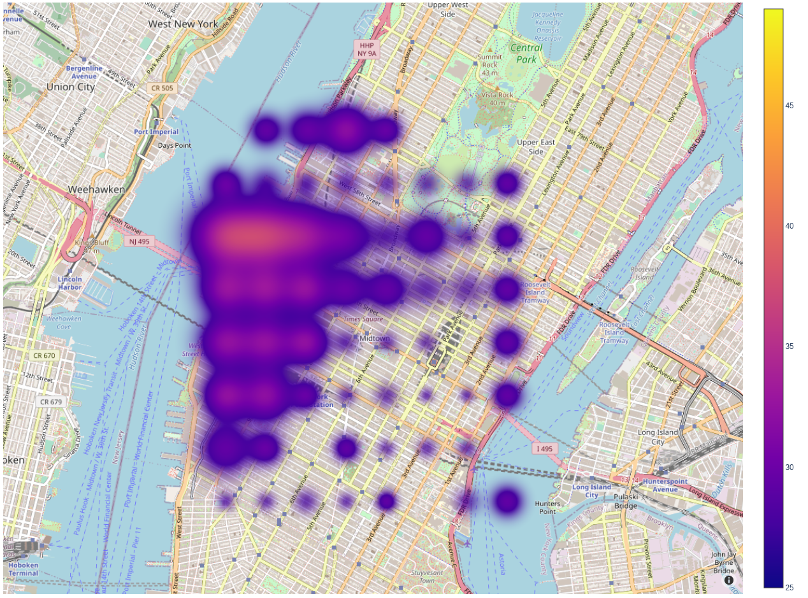
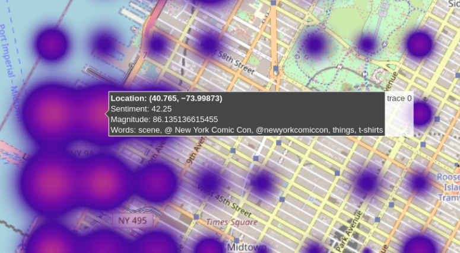

# Tweet Event Map


The goal of this project is to create a easy and intuitive tool of letting people know what is going on in their city based on tweets. 

Run by:

```
python main.py
```

## Requirements
    - python >= 3.6
    - tweepy >= v4.0.0
    - geopy >= 2.2.0
    - google-cloud-language >= 2.2.2
    - plotly >= 5.3.1
    - PyQt5 >= 5.15.4

## Modules

### twitter_api

Retreiving tweets in given area specified using latitude and longitude.


### geocoder_api

Retreiving latitude and longitude and address of a given location.


### language_api

Performing NLP tasks such as sentiment analysis and entity extraction.


## Heatmap

Generating an interactive heatmap that shows the sentiment of different locations in a region. Below is an example of sentiments of a list of locations sampled uniformly in the NYC. The color indicates the sentiment, while the size indicates the magnitude of sentiments (squared sum of all sentiments).  



Hovering the mouse over a region will show detailed information about the area, including the coordinate, sentiment and magnitude value, as well as keywords describing the area. As shown in the image below, we can tell that people are excited about Comic Con @ NYC from the extracted keywords.



